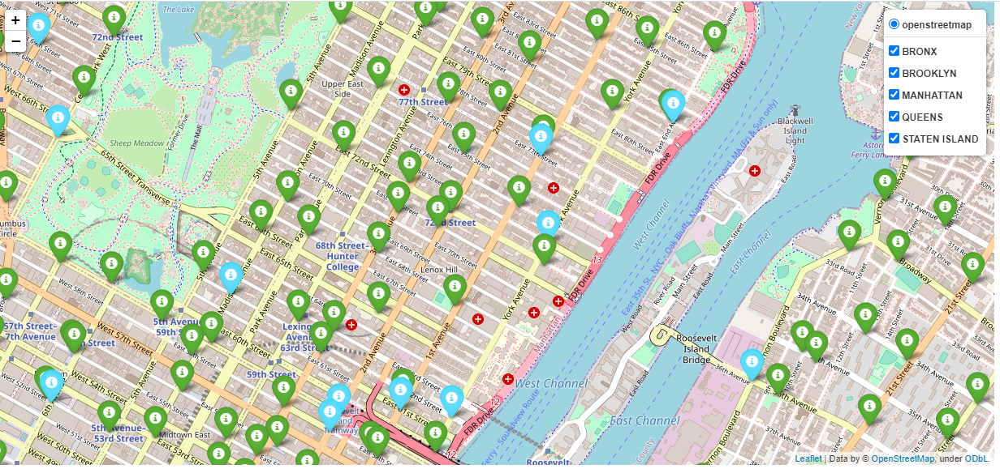

# creditshelf-collisions-map

### Prerequesite

Python 3.9.0 available at https://www.python.org/downloads/

### How to set up locally

Download project or clone this repository using:

```sh
$ git clone  
```
Install packages in requierement.txt file. If you are using an IDE (PyCharm), allow it to install the required dependencies automatically.

```sh
pip install requests
pip install pandas
pip install folium
pip install flask
```
### How to run the project
```sh
python load_data.py

python run_app.py
```
Go to http://127.0.0.1:5000/ to visualize the map


###  Map

