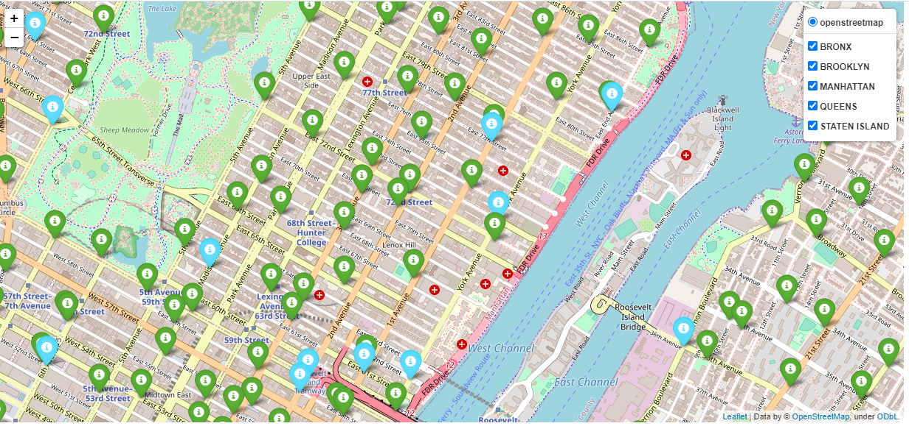

# collisions-map
This web application displays a map of the motor vehicle collisions of the city of New York, filtered by borough. Based on the following dataset: https://data.cityofnewyork.us/Public-Safety/Motor-Vehicle-Collisions-Crashes/h9gi-nx95

Developed using flask framework and folium

### Prerequisite

Python 3.9.0 available at https://www.python.org/downloads/

### How to set up locally

Download project or clone this repository using:

```sh
$ git clone https://github.com/nahlaerrakik/collisions-map.git
```
Install packages in requierement.txt file. If you are using an IDE (PyCharm), allow it to install the required dependencies automatically.

```sh
pip install requests
pip install pandas
pip install folium
pip install flask
```
### How to run the project
```sh
python application/run.py
```
Go to http://127.0.0.1:5000/ to visualize the map


###  Map

